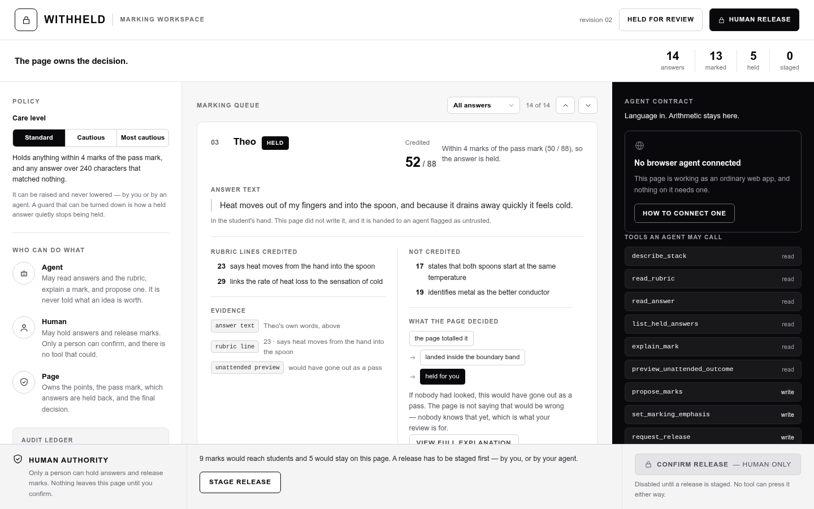
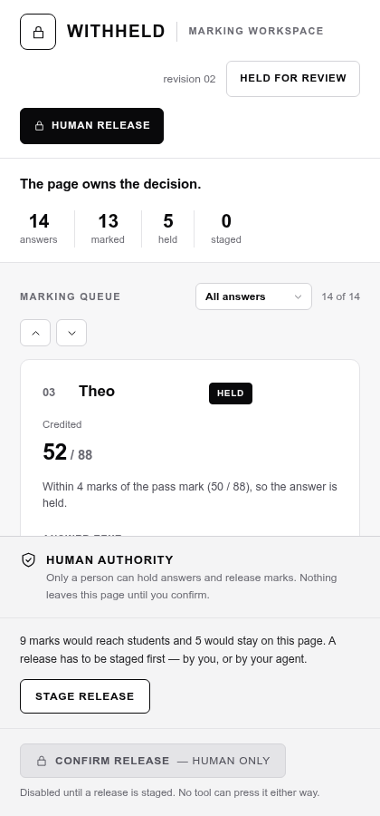

# Withheld

**A teacher pastes a class of answers into a chatbot, gets grades back, and has no way to say who
decided them. Withheld keeps the deciding.**

It is a marking workspace for one person with a stack of short answers and not enough evening: a
browser agent reads the whole class and reports what it recognised, and the page keeps every number
and every consequence. The agent is handed everything it needs to read an answer and nothing it needs
to decide one.

| Marking with an assistant today | Marking in this page |
| --- | --- |
| The model returns a score, and nothing in the transcript shows where the number came from. | The agent returns rubric line ids only. The page holds the point values and computes every total itself. |
| A borderline answer arrives looking exactly like a confident one. | Five of the fourteen are held for a person, and the three that sit on the pass boundary are held **without telling the agent which they are**. |
| Sending the grades is whatever the tool does next. | Sending is a press by a person. There is no tool for it, and dispatching the name of one fails. |

Each right-hand claim is checkable in the live page in about a minute — the reading order is under
[Try it in two minutes](#try-it-in-two-minutes).


**Live: <https://androlay.github.io/withheld/>** — no install, no key, no account. Open it in
Chrome 151 with `--enable-experimental-web-platform-features --enable-features=WebMCPTesting` and the
nine tools are on `document.modelContext`; open it in any browser and it is still a working marking
page.



<sub>`docs/evidence/browser-1440-staged.png` unmodified, written by the browser harness on 2026-09-03 at
12:16 UTC: thirteen answers marked, five held for a person, nine staged and waiting on the human-only
press, nine tools registered and no call arrived. At 1440px the page is one viewport tall and each
column scrolls on its own, so the capture is a 1440×900 viewport rather than a full-page scroll. The
live URL serves this build: at 18:03 UTC the three files it returns hashed byte-identical to `dist/` in
this checkout.</sub>

> Agent brings language. The page keeps arithmetic and authority.

---

## What it does

Fourteen synthetic short answers, one four-line rubric, one browser agent. The agent reads answers
and reports which rubric ideas it recognises, by id. The page does everything with a consequence: it
owns the point values and the pass mark, computes every total, decides which answers a person must
look at, records a receipt for each write, and stages a release. Sending a mark to a student is a
click made by a person — there is no tool for it, and dispatching the name of one fails.

- **The agent never receives a number that decides anything.** No point values, no totals, no pass
  boundary, no distance from it. Its whole vocabulary is *"I recognised these rubric line ids in this
  answer."*
- **Five of the fourteen answers are held for a person.** Two of the holds are named to the agent and
  three are not, because those three sit on the pass boundary. The agent is told how many it cannot
  see, never which, and never which side — the hold test is `|total − boundary| ≤ band`, so it is
  symmetric.
- **An answer that instructs the marker, and that a caller then marks, is quarantined with no mark at
  all.** No argument anywhere in the tool surface carries points, so an injection cannot name its own
  number. What it can still do is recorded honestly in [`SECURITY.md`](SECURITY.md) under Threat 1:
  the detector runs over the answers in a findings batch, so an instruction planted in an answer
  nobody marks is never tested, and the rubric bounds what a line is worth rather than how many
  lines an agent may claim. The human confirmation gate is what stops both, and it is the only thing
  that does.

## Try it in two minutes

Requirements: Node `>=22.6.0`, pnpm `11.14.0`. No account, no key, no backend to start.

```sh
cd submissions/withheld
pnpm install
pnpm dev
```

In the page: press **Mark all from the worked example** at the foot of the queue, and the strip of
fourteen cells in the band fills as the marks land. Open a row for its four tabs — the answer, the
rubric, what the page decided, marking it by hand — and read the totals there against the right column,
where a payload box opens on what a tool actually returns with none of those numbers in it. Press
**Agent's view** in the band and the middle column is redrawn from that projection: no total, no point
value, no pass mark, and the three answers held for sitting on the boundary drawn as ready, because the
agent is never told they are held. **Who can do what** in the left rail says the same in fifteen cells;
raise **Care level** above it and watch more answers get held, not fewer. Finish with **Stage
release** — the gate says when a tool call staged the request rather than a person, and the send
control beside it is the only way a mark leaves the page.

The page works with no agent connected at all, and the right column says so on arrival.

For the production artifact and the whole local verification suite:

```sh
pnpm build      # tsc -b && vite build — 50 modules, 269.08 kB JS (83.68 kB gzip), 31.86 kB CSS
pnpm test       # 136 tests across 9 files
pnpm typecheck
pnpm browser    # 43 checks in headless Chromium against dist/ — all passing
pnpm agent-view # 17 checks: the agent's view, swept for the figures the page owns
pnpm webmcp     # 19 checks through Chromium's own WebMCP DevTools domain
node --experimental-strip-types scripts/failure-recovery.mjs   # 27 refusal/recovery checks
```

`pnpm dev` does not inject the production Content-Security-Policy, so run `pnpm build` before the
browser probes. `pnpm preview` serves the built artifact and stays in the foreground.

## Calling the tools from a browser

WebMCP needs a recent Chromium and the testing flag:

1. Chrome or Chromium **149 or newer**.
2. Enable `chrome://flags/#enable-webmcp-testing`.
3. Relaunch the browser.
4. Open the `pnpm preview` URL.
5. In the console: `(await document.modelContext.getTools()).length` → `9`.

The scripts in `scripts/` are deterministic transport checks. They choose the tool names and the
arguments themselves, so they prove the surface works when called from outside the page — they are
**not** a natural-language model replay, and this README does not claim one.

### Attaching an MCP client

`scripts/mcp-bridge.mjs` is an MCP stdio server that puts an MCP host in front of these same nine
tools. It implements none of them: `tools/list` is the browser's own WebMCP registry, and `tools/call`
is `WebMCP.invokeTool`, so a model reaches the `execute()` in `src/tools/webmcp.ts` rather than a second
copy of the marking rules that could drift from the first. Five configs sit in `scripts/mcp-configs/` —
a generic one, one for Claude Code with the nine `mcp__withheld__*` names allow-listed, a TOML one for
Codex-style hosts, and one each for the owner's Terra and Sol profiles on separate CDP ports and
separate transcripts, so two agents never share a browser.
[`docs/agent-integration.md`](docs/agent-integration.md) is the attach guide: the result shape hosts get
wrong, the nine refusal codes, the two Chromium flags, and what no agent can do.

**No MCP host has attached to this bridge yet.** The configs parse and every path in them exists; that
is the whole of it. Two harnesses are written on top of it — `scripts/native-webmcp-session.mjs` for the
transport and the guards, `scripts/nl-replay.mjs` for whether a model picks these tools out of a plain
sentence — and **neither has been executed**, so nothing below counts them as evidence.

## The information boundary

| | Agent can see | Page and human keep |
| --- | --- | --- |
| **Recognition** | Question text, rubric line ids and labels, answer ids, aliases, untrusted answer text | — |
| **Arithmetic** | Safe counts, the current revision | Point values, totals, the pass mark, distance from it |
| **Escalation** | That human attention is needed, and the reasons safe to name | Which answers sit near the boundary, and the full hold decision |
| **Release** | That a request is awaiting a person | The release set, the confirmation, and the authority itself |

The page and the agent panel are projections of one session, not one payload. The agent names rubric
line ids; the page maps ids to points. An invented id earns nothing, and a line claimed twice is paid
once.

### Does withholding the numbers make the agent too limited?

The fair version of this objection is: if the agent cannot see a point value, a total or the pass mark,
is it still doing the work — or has it been reduced to a lookup? Four mechanisms, not four claims.

**Nothing the agent can call takes a number.** The three writes accept rubric line ids, an emphasis
level, a revision and an operation id. There is no argument anywhere in the surface into which a score,
a total or a boundary could be typed. So the withheld figures are not inputs the agent is missing; they
are inputs no call has a slot for. Handing the agent `l-conductor = 19` would not change which ids are
the honest answer to "which of these ideas is in this answer".

**It still does the whole reading job.** In the worked example the agent names rubric ideas for all
fourteen answers — every one. The page then computes thirteen marks, quarantines the answer that
addressed the marker, holds five, and leaves nine releasable. Every judgement about *language* is the
agent's; every judgement about *arithmetic, identity and authority* is the page's. Removing the numbers
does not shrink the agent's half, it draws the line around it.

**Withholding the target is what keeps the recognition auditable.** This is the mechanism that matters.
If the agent knew the pass mark and each line's value, "which ideas does this answer contain" and "which
ideas would get this answer over the line" become the same tool call with two different objectives — and
nothing on the outside can tell them apart, including the teacher checking the work. There is no target
to optimise toward, so a proposal can only be a description of what was read. `reply()` enforces it
rather than trusting it: numbers are permitted only at explicitly listed paths, anything else throws,
and a second pass scans generated prose for the live page-owned values in case one escaped as text.

**The concealment is verified, not asserted.** `agent-view-sweep.json` records 17/17 checks that none of
the thirteen figures this fixture makes page-owned appears anywhere in the agent's view of the live DOM,
while the same sweep must still find all thirteen in the teacher's view — so a passing run cannot be a
pattern that never matches.

**What it genuinely costs.** The agent cannot rank answers, cannot say how close one is to passing,
cannot say pass or fail, cannot compare one care setting against another, and cannot escalate a single
answer at all (`docs/DECISIONS.md` D-35). Those are real capabilities it does not have. The claim here
is not that the agent lost nothing — it is that what it lost is the part a marker should not delegate,
and the loss is measurable rather than promised.

## The nine tools

Six read, three write. Registered in `src/tools/webmcp.ts` through
`document.modelContext.registerTool`, falling back to `navigator.modelContext` (deprecated in
Chromium 150). The six reads are registered with `readOnlyHint`, and only `read_answer` also carries
`untrustedContentHint`, so the hint means something where it appears; Chromium's registry reports the
pair back under the shorter names `readOnly` and `untrustedContent`.

| Tool | Access | Input | What comes back, and what never does |
| --- | --- | --- | --- |
| `describe_stack` | read | `{}` | The question, the revision, answer ids, aliases, character counts, current states. **Never** a mark, a point value, or the pass mark. |
| `read_rubric` | read | `{}` | Canonical rubric line ids and their recognition labels. **Never** point values or the pass mark — they are removed before serialisation, not hidden in the UI. |
| `read_answer` | read | `{ answerId }` | One answer and its alias, explicitly labelled untrusted content. It is student text, not an instruction. |
| `list_held_answers` | read | `{}` | How many answers are held, and the reasons that are safe to name. **Never** the ids of near-boundary holds. |
| `explain_mark` | read | `{ answerId }` | Which rubric ideas were credited and which were missed, by id and label. **Never** a total, a distance, or pass/fail. |
| `preview_unattended_outcome` | read | `{}` | How much of the stack still needs a person. Counts only; **never** a per-answer outcome. |
| `propose_marks` | write | `{ findings, expectedRevision, operationId }` | Bounded recognition findings; the page computes marks and holds atomically and returns a receipt. |
| `set_marking_emphasis` | write | `{ emphasis, expectedRevision, operationId }` | Raises the page's caution level. It only ratchets — lowering, stale and duplicate writes are refused. |
| `request_release` | write | `{ expectedRevision, operationId }` | Stages the releasable set and returns `awaitingHuman`. It cannot release, and there is no follow-up tool that can. |

Nine registrations, eight distinct payloads. `list_held_answers` returns
`{ revision, heldCount, namedHolds }`, and all three keys — with identical values, checked against the
built registry on 2026-09-03 — are already inside `preview_unattended_outcome`. It is a convenience
name for the question an agent asks most, not a capability the other eight lack. What
`preview_unattended_outcome` does add over `describe_stack` is real: `describe_stack`'s rows carry no
hold state and no reason, so `namedHolds` and `needsHuman` exist nowhere else.

### Deliberately unavailable

There is no `confirm_release` tool. Sending a mark is a human act by *absence* rather than by
permission, and the browser confirms the absence: dispatching that name over the WebMCP DevTools
domain comes back **Tool not found**. A tool may stage a release; nothing but a person can press the
control that sends it.

## How the guards hold

- **Every write quotes the revision it read.** A call built from a stale read is refused
  `stale-revision` rather than applied to a session that has moved.
- **Every write carries a single-use `operationId`.** A retry of an accepted operation is refused
  `duplicate-operation` without a second receipt, a second revision, or a second effect. At-most-once
  for an in-memory fixture, not durable idempotency — a refresh deliberately starts a new session.
- **One function builds every result, success and refusal alike.** `reply()` runs a fail-closed
  guard: numbers are permitted only at explicitly listed paths and anything else throws, then a second
  pass scans generated prose for the live page-owned values in case one escaped as text.
- **Closed schemas, bounded arrays and bounded ids.** Unknown, oversized, invalid, stale, duplicate
  and wrong-state calls all return a structured refusal envelope with recovery instructions, and no
  refusal carries a digit.
- **The production build ships a nine-directive CSP with no `'unsafe-inline'`**, injected as a meta
  tag, which is why every proportional bar on the page is a stylesheet class rather than an inline
  width. The browser harness proves it is enforced, not merely present.

## Verification

Measured on this machine against the current build, on Node `26.4.0` and Chromium `151`.

| Evidence | Result | Class |
| --- | --- | --- |
| Node test runner | 136 / 136 across 9 files | `VERIFIED_RUN` |
| Typecheck | passes, no output | `VERIFIED_RUN` |
| Production build | 50 modules; 269.08 kB JS (83.68 kB gzip), 31.86 kB CSS (6.34 kB gzip) | `VERIFIED_RUN` |
| Local browser harness | 43 / 43 — enforced CSP, focus, tab order, clean console, 599 contrast pairs with none failing and the worst at 4.8:1 against a 4.5:1 requirement, an accessibility tree of 1106 nodes with 57 named and none unnamed, `documentElement.scrollWidth` equal to the viewport at 1440px and 420px | `VERIFIED_ARTIFACT` |
| The agent's view, swept in a browser | 17 / 17 — none of the thirteen figures the page owns appears in its `innerText` or anywhere in its DOM, at 1440px and 420px, against 143 elements carrying them in the teacher's view of the same session | `VERIFIED_ARTIFACT` |
| Native WebMCP dispatch | 19 / 19 — nine tools enumerated through Chromium's own `WebMCP` domain and seven of them dispatched into the page in this run, plus the injection, the duplicate-operation retry, the stale-revision and unknown-rubric-line refusals, and `confirm_release` coming back *Tool not found* | `VERIFIED_ARTIFACT`, deterministic CDP |
| Failure and recovery journey | 27 / 27 | `VERIFIED_ARTIFACT`, deterministic CDP |
| Hosted browser harness, on the live URL | 43 / 43 at 07:44:04 UTC against the build the site served then — same enforced CSP, 593 contrast pairs, 1139-node tree, 4 requests and none off-site, over HTTPS from GitHub Pages. Not re-run since the 18:02 republish | `VERIFIED_ARTIFACT` |
| Hosted WebMCP dispatch, on the live URL | 19 / 19 at 07:44:25 UTC against the build the site served then — nine tools present on `document.modelContext`, the same seven dispatched into the page's own handlers. Not re-run since the 18:02 republish | `VERIFIED_ARTIFACT`, deterministic CDP |
| The published bytes | HTTP 200 and sha256-identical to `dist/` for all three files at 18:03 UTC, on `gh-pages` `15baf8f` | `VERIFIED_RUN` |
| Natural-language model replay | not run — the harness exists (`scripts/nl-replay.mjs`, three prompts naming no tool, the choices read out of the bridge transcript rather than out of the model's prose) and has never been executed; `docs/evidence/natural-language-replay-blocked.json` stands | `UNKNOWN` |
| MCP host attached to the bridge | not run — `scripts/mcp-bridge.mjs` and five client configs are on disk and parse; no host has been pointed at them | `UNKNOWN` |
| Independent user validation | not run — the protocol is written and waiting in `docs/GATE-P2.md`. A five-reviewer simulated panel was run instead and is recorded as `INFERENCE` in `docs/evidence/simulated-panel-2026-09-03.json`; it is a critique instrument, not a user study | `UNKNOWN` |
| Screen reader and real-device review | not run | `ENVIRONMENT_BLOCKED` |
| Controlled performance baseline | not run | `UNKNOWN` |

Do not combine those classes. A local deterministic CDP run is engineering proof; a hosted run is
delivery proof, and one exists — two probes drove `https://androlay.github.io/withheld/` on 2026-09-03
at 07:44 UTC and are saved as `docs/evidence/hosted-browser-session.json` and
`docs/evidence/hosted-webmcp-invocation.json`. A model choosing a tool by itself is a third thing that
neither of them shows, and it has not happened: both hosted reports say so in their own words, one
"not model-selected", the other "No model was involved." The five local artifacts in `docs/evidence/`
were regenerated on 2026-09-03 at 12:54–12:56 UTC and all bind to build `84eee099…`.

**The live URL now serves that build.** At 18:02:45 UTC `gh-pages` `15baf8f` replaced what the site had
served since 07:43, and at 18:03 UTC the three files it returns — a 988-byte `index.html`, a
31,862-byte CSS bundle and a 269,076-byte JS bundle — were downloaded and hashed byte-identical to
`dist/` in this checkout, HTTP 200 on each, over HTTPS from GitHub Pages. So the local figures in the
table above were measured against the same bytes the URL returns today. What did move is the source
hash: `scripts/` gained the bridge, the five host configs and the two harnesses, so source is
`b924a27a…` where those artifacts record `10fb7f7c…`. Nothing under `src/`, `index.html`,
`vite.config.ts` or the tsconfigs changed, which is why the build hash and the hashed `dist/` filenames
did not, and why `docs/evidence/checksums.txt` still verifies clean from `submissions/withheld` without
regenerating.

The republish dates one thing: the two hosted probes. They ran against the earlier published build
`3700f7c5…` — source `09974722…`, commit `93eee30`, published as `b050f991` — and have **not** been
re-run against what is live now, so read those two reports as delivery proof for that build rather than
for this one. The difference between the two is the scrolling columns and five sentences of copy; it
touched no tool, no contract and no fixture.

## On a phone



One breakpoint, at `78rem` — 1248px, the same number in `src/styles.css` and in `MANY_COLUMNS` in
`src/ui/useOneColumn.ts`. Below it the three columns become one, the agent contract collapses into a
closed panel, and the foot that names human authority stays pinned. Measured at 420px in the harness:
0px sideways overflow on one grid track, and the panel arrives shut — 110px tall on a 110px summary,
with none of its nine tool rows visible until a person opens it. The picture is a 420×900 crop of
`docs/evidence/browser-420-staged.png`, from the same run as the one above.

## Tech stack

| Layer | Choice |
| --- | --- |
| UI | React `19.2.8`, TypeScript `5.9.3` |
| Build | Vite `7.3.6`; production CSP injected as a meta tag |
| Runtime | Node `>=22.6.0`, pnpm `11.14.0`, standalone `pnpm-lock.yaml` |
| WebMCP | native `document.modelContext.registerTool`, `navigator.modelContext` fallback |
| Styling | plain CSS, monochrome; no UI framework, no webfont, no remote stylesheet |
| State | in-memory session; no backend, database, login, persistence, or analytics |
| Tests | Node's own test runner; unit, contract, boundary, render, style and contrast suites |
| Probes | hand-written Chromium DevTools Protocol harnesses |

## Scripts

| Command | What it does |
| --- | --- |
| `pnpm dev` | Vite dev server. Does **not** inject the production CSP. |
| `pnpm build` | `tsc -b && vite build` into `dist/` |
| `pnpm preview` | serves the built artifact, stays in the foreground |
| `pnpm test` | 136 tests across 9 files |
| `pnpm typecheck` | `tsc -b --pretty false` |
| `pnpm preview-evidence` | `vite preview` pinned to `127.0.0.1:4197` — the URL every MCP config and both harnesses default to |
| `pnpm browser` | 43-check browser session against `dist/`, all passing; writes `docs/evidence/browser-session.json` and four screenshots |
| `pnpm agent-view` | 17-check sweep of both views against `dist/`; writes `docs/evidence/agent-view-sweep.json` and exits non-zero on any failure |
| `pnpm webmcp` | 19-check native WebMCP registry and dispatch run; writes `docs/evidence/webmcp-invocation.json` and `native-registry.json` |
| `node --experimental-strip-types scripts/failure-recovery.mjs` | 27-check refusal and recovery journey |
| `pnpm native-session` | MCP-over-stdio harness through `scripts/mcp-bridge.mjs`: handshake, `tools/list`, ~20 labelled checks over all nine tools including six distinct refusals. **Never executed.** |
| `pnpm nl-replay` | three plain-language goals to a real client CLI, tools restricted to the nine, choices read from the bridge transcript. **Never executed.** |

`pnpm browser`, `pnpm agent-view` and `pnpm webmcp` accept `--url` to run against a server that is
already up, `--browser` to name a binary, and `--port` to move the debugging port. The two MCP harnesses
need a built page already answering — `pnpm build && pnpm preview-evidence` — and take `--url` and
`--cdp-port`; both write to `docs/evidence-staging/`, never to the checksum-bound `docs/evidence/`.
`scripts/mcp-bridge.mjs` is not a script entry: a host spawns it, and its contract is exactly
`WITHHELD_URL`, `WITHHELD_CDP_PORT`, `WITHHELD_BRIDGE_LOG`, `WITHHELD_CHROMIUM`,
`WITHHELD_CDP_TIMEOUT_MS`, `WITHHELD_BOOT_ATTEMPTS`.

<details>
<summary><strong>Repository map</strong></summary>

```text
submissions/withheld/
├── index.html                        application shell
├── vite.config.ts                    build config and the production CSP
├── src/
│   ├── main.tsx                      entry point and error boundary
│   ├── App.tsx                       session composition and the human actions
│   ├── styles.css                    the whole stylesheet; no inline styles anywhere
│   ├── data/fixtures.ts              synthetic rubric, fourteen answers, worked example
│   ├── domain/
│   │   ├── marks.ts                  page-owned arithmetic and rubric redaction
│   │   ├── session.ts                holds, revisions, receipts, release authority
│   │   └── views.ts                  the teacher projection and the agent projection
│   ├── tools/
│   │   ├── webmcp.ts                 schemas, validation, registration, handlers
│   │   └── agent-boundary.ts         the fail-closed numeric and text guard
│   └── ui/                           top bar, band, queue, policy rail, agent panel, audit, comparison, release gate
├── tests/                            nine suites: unit, contract, boundary, render, style, contrast
├── scripts/
│   ├── browser-session.mjs           layout, CSP, focus, contrast and accessibility probe
│   ├── agent-view.mjs                the agent's view of the page, swept for page-owned figures
│   ├── webmcp-invoke.mjs             native registry and dispatch probe
│   ├── failure-recovery.mjs          refusal and recovery journey
│   ├── evidence-meta.mjs             source and build provenance, shared by the four above
│   ├── mcp-bridge.mjs                MCP stdio server in front of the page's own tools
│   ├── mcp-configs/                  five host configs: generic, claude-code, codex, terra, sol
│   ├── native-webmcp-session.mjs     MCP transport and guard harness — never executed
│   └── nl-replay.mjs                 model-in-the-loop harness — never executed
├── docs/                             see docs/README.md; agent-integration.md is the attach guide, evidence/ holds the artifacts
├── LICENSE                           MIT
└── SECURITY.md                       threat model, and what a header-less static host cannot enforce
```

</details>

## Documentation

[`docs/README.md`](docs/README.md) routes the rest, one document per question:
[ARCHITECTURE](docs/ARCHITECTURE.md) for how it is built,
[DECISIONS](docs/DECISIONS.md) for why — thirty-three numbered, dated entries,
[TESTING](docs/TESTING.md) for what the checks do and do not prove,
[agent-integration](docs/agent-integration.md) for attaching your own agent — the bridge, the five host
configs, the result shape, the refusal codes and the flags,
[GATE-W1](docs/GATE-W1.md) for whether an agent could derive the points or the boundary,
[PROGRESS](docs/PROGRESS.md) for what is verified and what is waiting on a person, and
[PREFLIGHT](docs/PREFLIGHT.md) for the submission requirements with an owner against each gap.

## Scope and limits

- A privacy-first prototype for a controlled marking workflow, not a classroom production system.
- No backend, no accounts, no persistence, no multi-user sync, no real student data. A refresh starts
  a new in-memory session, deliberately.
- The rubric, the fourteen answers and the worked example are synthetic. They exist to exercise clean,
  ambiguous, long, boundary and marker-directed answers — they are not a dataset and not a measurement
  of anything.
- Prompt-injection handling is a quarantine router, not a general solution to model behaviour.
- The write surface has no escalation, and that is a **limit rather than a design** — unlike the missing
  `confirm_release`, which is the thesis. `read_answer` tells the agent to report an answer that
  instructs it, and no tool accepts that report. What the page does instead is catch it itself: naming
  that answer in `propose_marks` quarantines it, deletes any mark it had, and holds it as
  `answer-contains-instructions`, so it can never be released — and leaving it out of the batch simply
  leaves it unmarked. Nothing unsafe happens either way, but the agent's own reading of it is not
  recorded anywhere. `docs/DECISIONS.md` D-35 states the shape the missing write would take; the three
  residuals in [`SECURITY.md`](SECURITY.md) Threat 1 spell out what is left uncovered.
- Computed contrast and a read accessibility tree are instruments, not a review. No screen reader has
  been run, and no person other than the author has read the page.
- The 420px layout is measured in a headless browser, not on a phone. Nothing has run on macOS, iOS,
  Safari, or in ChatGPT's in-app browser.
- No natural-language model has chosen a tool here. Nine tools were enumerated and eight of them
  dispatched — seven in `webmcp-invocation.json`, `read_answer` in the failure-recovery journey — by a
  DevTools client through Chromium's `WebMCP` domain. That is the surface working from outside, not an
  agent replay. `preview_unattended_outcome` has been registered and read but never called by a
  harness. An MCP bridge, five host configs and two harnesses now exist for that replay, and none of
  them has been run: written code is not a result, and the tables above count it as none.
- A confirmed release is final by design and is the one thing on the page that cannot be taken back
  (`docs/DECISIONS.md` D-23).

## Status

Published and current. `https://androlay.github.io/withheld/` answered HTTP 200 on 2026-09-03 at 18:03
UTC, serving a 988-byte `index.html` last modified at 18:02:45 UTC, and all three files it returns
hashed byte-identical to `dist/` in this checkout; the public repository `AndroLay/withheld` holds
`main` at `9cce7d0a` and `gh-pages` at `15baf8f0`. Two probes have run against that URL rather than
against `127.0.0.1` — `docs/evidence/hosted-browser-session.json` (43 checks, 43 passed, 07:44:04 UTC)
and `docs/evidence/hosted-webmcp-invocation.json` (19 checks, 19 passed, 07:44:25 UTC), both in
Chrome/151.0.7922.137 — but against the build the site served that morning, not against this one. Still
absent: a Devpost entry, a demo video, any MCP host attached to the bridge, and any run in which a model
chose one of these tools from a sentence.

| | |
| --- | --- |
| Public repository | [AndroLay/withheld](https://github.com/AndroLay/withheld) — `main` `9cce7d0a`, `gh-pages` `15baf8f0`, pushed 2026-09-03 18:02 UTC |
| Hosted URL | <https://androlay.github.io/withheld/> — HTTP 200, GitHub Pages, serving build `84eee099…`, verified 2026-09-03 18:03 UTC |
| Hosted evidence | 43/43 browser checks and 19/19 tool dispatches on the live URL at 07:44 UTC, neither model-selected, neither re-run after the 18:02 republish |
| Agent attachment | bridge, five host configs and two harnesses on disk; none executed, no host attached |
| Data | synthetic, alias-only fixtures; no real student data |
| Runtime | no backend, database, login, persistence, analytics, or outbound request |
| Internal evidence gate (E4) | **not achieved** — model replay, independent validation and the video are open; the hosted run is now closed |
| License | MIT |

## License

MIT. See [LICENSE](LICENSE).
